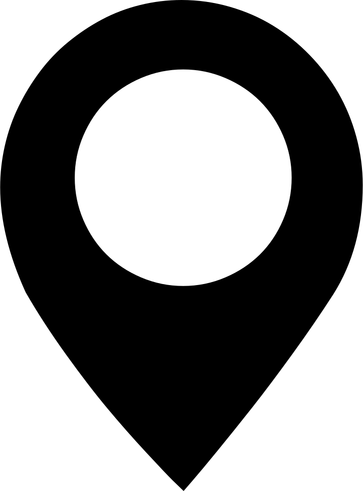

<!-- PROJECT SHIELDS -->
<!--
*** I'm using markdown "reference style" links for readability.
*** Reference links are enclosed in brackets [ ] instead of parentheses ( ).
*** See the bottom of this document for the declaration of the reference variables
*** for contributors-url, forks-url, etc. This is an optional, concise syntax you may use.
*** https://www.markdownguide.org/basic-syntax/#reference-style-links
-->


[![Contributors][contributors-shield]][contributors-url]
[![Forks][forks-shield]][forks-url]
[![Stargazers][stars-shield]][stars-url]
[![Issues][issues-shield]][issues-url]
[![MIT License][license-shield]][license-url]
[![LinkedIn][linkedin-shield]][linkedin-url]


<!-- PROJECT LOGO -->
<br />
<p align="center">
  <a href="https://github.com/JMark1991/Photo_Tagger">
    
  </a>

  <h3 align="center">PHOTO_TAGGER</h3>

  <p align="center">
    Ever looked through old photos and wonder where they were taken? </br>
    Here's your solution, just upload your photos and the location is calculated in a few seconds.</br>
    Try it now!
    <br />
    <a href="http://photo-tagger.herokuapp.com/"><strong>» Photo Tagger «</strong></a>
    <br />
    <br />
    <a href="https://github.com/JMark1991/Photo_Tagger">Explore the docs</a>
    ·
    <a href="https://github.com/JMark1991/Photo_Tagger/issues">Report Bug</a>
    ·
    <a href="https://github.com/JMark1991/Photo_Tagger/issues">Request Feature</a>
  </p>
</p>


<!-- TABLE OF CONTENTS -->
## Table of Contents

* [About the Project](#about-the-project)
  * [Built With](#built-with)
* [Getting Started](#getting-started)
  * [Prerequisites](#prerequisites)
  * [Installation](#installation)
* [Usage](#usage)
* [Roadmap](#roadmap)
* [Contributing](#contributing)
* [License](#license)
* [Contact](#contact)
* [Acknowledgements](#acknowledgements)


<!-- ABOUT THE PROJECT -->
## About The Project

[![Photo_Tagger_Screenshot][product-screenshot]](http://photo-tagger.herokuapp.com/)

This project started as the my Final Project of the Ironhack Data Analytics and Machine Learning Bootcamp that I took.

But there were many ideas I had that I had to put aside due to time constraints, so after the bootcamp I started using the work I started as a test bed for more things I wanted to learn and to practice.


### Built With

* [Python](https://www.python.org/)
* [Flask](https://flask.palletsprojects.com/)
* [Keras](https://keras.io/)
* [Docker](https://www.docker.com/)
* [Heroku](https://www.heroku.com/)


<!-- GETTING STARTED -->
## Getting Started

To get a local copy up and running follow these simple steps.

### Prerequisites
```sh
docker
```
### Installation

1. Clone the repo
```sh
git clone https://github.com/JMark1991/Photo_Tagger.git
```
2. Build the docker image
```sh
docker build ###
```
3. Run the docker image
```sh
docker run ###
```


<!-- USAGE EXAMPLES -->
## Usage

The app is ready to use <a href="http://photo-tagger.herokuapp.com/">here</a>.

<!--
_For more examples, please refer to the [Documentation](https://example.com)_   
-->


<!-- ROADMAP -->
## Roadmap

See the [open issues](https://github.com/JMark1991/Photo_Tagger/issues) for a list of proposed features (and known issues).


<!-- CONTRIBUTING -->
## Contributing

Contributions are what make the open source community such an amazing place to be learn, inspire, and create. Any contributions you make are **greatly appreciated**.

1. Fork the Project
2. Create your Feature Branch (`git checkout -b feature/AmazingFeature`)
3. Commit your Changes (`git commit -m 'Add some AmazingFeature'`)
4. Push to the Branch (`git push origin feature/AmazingFeature`)
5. Open a Pull Request


<!-- LICENSE -->
## License

Distributed under the MIT License. See `LICENSE` for more information.


<!-- CONTACT -->
## Contact

Jorge Marques - [LinkedIn](linkedin-url)

Project Link: [https://github.com/JMark1991/Photo_Tagger](https://github.com/JMark1991/Photo_Tagger)


<!-- ACKNOWLEDGEMENTS -->
## Acknowledgements

* [zegami/image-similarity-cluster](https://github.com/zegami/image-similarity-clustering)
* [othneildrew/Best-README-Template](https://github.com/othneildrew/Best-README-Template)


<!-- MARKDOWN LINKS & IMAGES -->
<!-- https://www.markdownguide.org/basic-syntax/#reference-style-links -->
[contributors-shield]: https://img.shields.io/github/contributors/JMark1991/Photo_Tagger.svg?style=flat-square
[contributors-url]: https://github.com/JMark1991/Photo_Tagger/graphs/contributors
[forks-shield]: https://img.shields.io/github/forks/JMark1991/Photo_Tagger.svg?style=flat-square
[forks-url]: https://github.com/JMark1991/Photo_Tagger/network/members
[stars-shield]: https://img.shields.io/github/stars/JMark1991/Photo_Tagger.svg?style=flat-square
[stars-url]: https://github.com/JMark1991/Photo_Tagger/stargazers
[issues-shield]: https://img.shields.io/github/issues/JMark1991/Photo_Tagger.svg?style=flat-square
[issues-url]: https://github.com/JMark1991/Photo_Tagger/issues
[license-shield]: https://img.shields.io/github/license/JMark1991/Photo_Tagger.svg?style=flat-square
[license-url]: https://github.com/JMark1991/Photo_Tagger/blob/master/LICENSE.txt
[linkedin-shield]: https://img.shields.io/badge/-LinkedIn-black.svg?style=flat-square&logo=linkedin&colorB=555
[linkedin-url]: https://www.linkedin.com/in/jorge-andre-marques/
[product-screenshot]: images/screenshot.PNG
